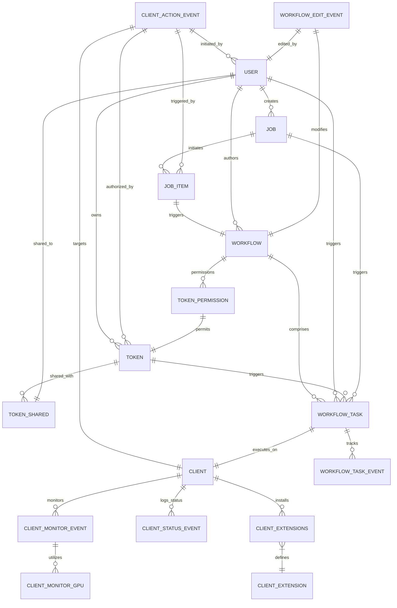

# ComfyUI Station

A web application for manager multiple instances of ComfyUI.

## Preview draft design

## Core Features

### 1. Client Management

- **Registration and Setup**: Managing the creation, configuration, and setup of new ComfyUI clients.
- **Client Authentication**: Handling different authentication modes for client security, including username and password management.

### 2. Client Monitoring and Reporting

- **Real-time Monitoring**: Monitoring CPU usage, memory usage, and GPU utilization and temperature in real time.
- **Event Logging**: Logging significant events related to client status changes, such as going offline or online.

### 3. Client Extensions

- **Extension Management**: Managing and configuring extensions specific to each client, allowing customization of the client's capabilities.

### 4. User and Access Management

- **User Accounts**: Managing user accounts, including roles, authentication (email, password), and financial accounts (balance management).
- **Authentication Tokens**: Managing authentication tokens for secure access, including master tokens and workflow-specific tokens.
- **Token Sharing and Permissions**: Facilitating the sharing of access tokens between users and managing permissions for workflows.

### 5. Job and Task Automation

- **Job Scheduling and Management**: Creating and managing jobs with scheduled tasks, allowing automation of routine tasks.
- **Task Execution and Monitoring**: Executing and monitoring individual tasks within jobs, linked to specific clients or workflows.

### 6. Workflow System

- **Workflow Creation and Management**: Defining and managing sequences of tasks (workflows) that automate complex operations across multiple clients.
- **Workflow Execution**: Assigning and executing tasks within a workflow on specified clients.
- **Workflow Task Tracking**: Tracking the progress and status of tasks within workflows.

### 7. Client Actions and Events

- **Action Logging**: Logging actions performed on clients, whether manually triggered or automated through jobs or workflows.
- **Event Response Management**: Responding to and managing events based on client status, user interactions, or automated triggers.

### 8. Data and Configuration Security

- **Secure Configuration**: Managing sensitive information such as user passwords and token details securely.
- **Data Integrity and Backups**: Ensuring the integrity of data through constraints and relational integrity across tables.

## Database flow (DRAFT)

## Contributing

Contributions are what make the open source community such an amazing place to learn, inspire, and create. Any contributions you make are **greatly appreciated**.

1. Fork the Project
2. Create your Feature Branch (`git checkout -b feature/AmazingFeature`)
3. Commit your Changes (`git commit -m 'Add some AmazingFeature'`)
4. Push to the Branch (`git push origin feature/AmazingFeature`)
5. Open a Pull Request

## License

Distributed under the MIT License. See `LICENSE` for more information.

## Contact

Tran Cong Tien - tctien342@gmail.com

Project Link: [https://github.com/tctien342/ntr-template](https://github.com/tctien342/ntr-template)
